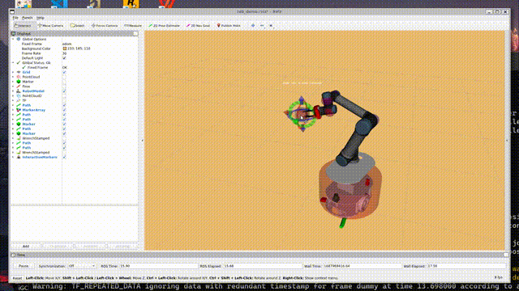

# mobile_manipulator_mpc
这是我在硕士期间的一部分研究：基于（非线性）模型预测控制的移动机械臂（mobile manipulator）运动规划与控制。计划开源几个最简单的demo实现。

# 安装
## 1. 使用Docker进行部署（推荐）
自行安装docker。随后在任意路径下执行以下命令。
```bash
git clone https://github.com/Matthew-WangT/mobile_manipulator_mpc.git
cd mobile_manipulator_mpc
bash build.sh
```
耐心等待docker镜像构建完毕(大约10分钟)，期间无需任何操作。构建完毕后，执行以下命令：
```bash
xhost +
docker run -it -e DISPLAY=$DISPLAY -v /tmp/.X11-unix:/tmp/.X11-unix mm_mpc:0.1.0
```
此时将进入名为mm_mpc的docker容器，在容器里编译：
```bash
cd ~/catkin_ws
catkin build -j
```
在笔者的电脑上，约16s左右即可编译完毕。
## 2. 自行编译
可参考Dockerfile的内容自行编译。

# Demos
## Demo1-移动机械臂末端执行器移动至目标点
```bash
source ~/catkin_ws/devel/setup.bash
roslaunch open_door_mpc rob_demo.launch
```
随后拖动Rviz中的交互对象，右键发送目标，移动机械臂即可实现跟随。


# Others
时间有限，或许存在部分冗余代码并未及时删去，请见谅。

# Refers
[1] Osman M , Mehrez M W , Yang S ,et al.End-Effector Stabilization of a 10-DOF Mobile Manipulator using Nonlinear Model Predictive Control[J].IFAC-PapersOnLine, 2020, 53(2):9772-9777.DOI:10.1016/j.ifacol.2020.12.2658.

[2] J. Pankert and M. Hutter, "Perceptive Model Predictive Control for Continuous Mobile Manipulation," in IEEE Robotics and Automation Letters, vol. 5, no. 4, pp. 6177-6184, Oct. 2020, doi: 10.1109/LRA.2020.3010721.

[3] OCS2的RVIZ可视化工具（interactive_marker）

[4] [
Mohamed W. Mehrez的casadi视频教程](https://www.youtube.com/watch?v=RrnkPrcpyEA&t=7s)
